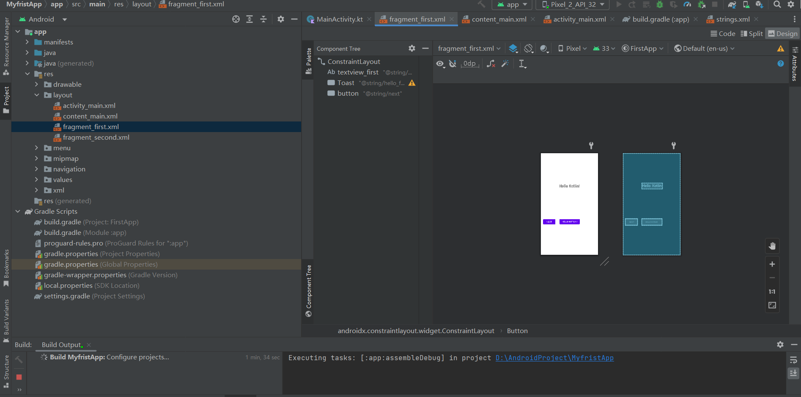
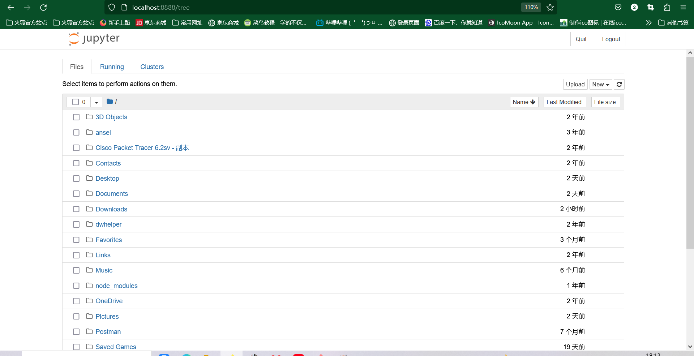
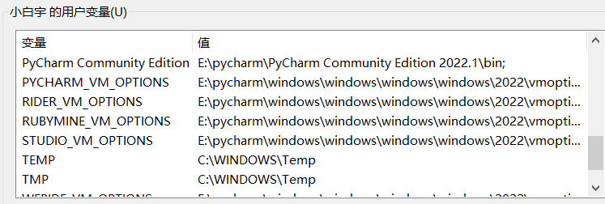
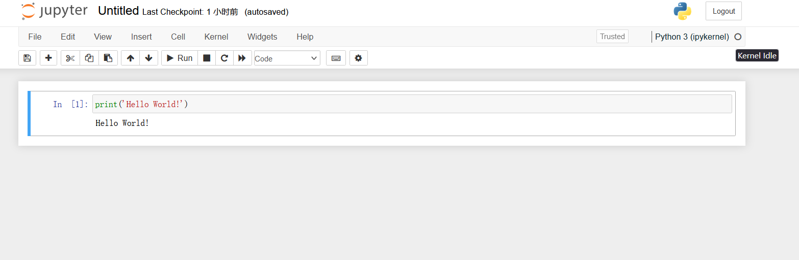
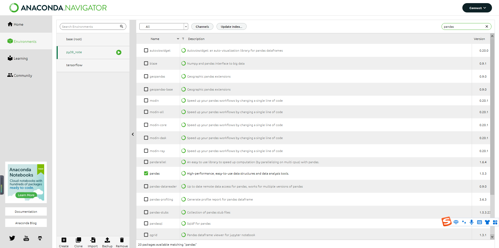
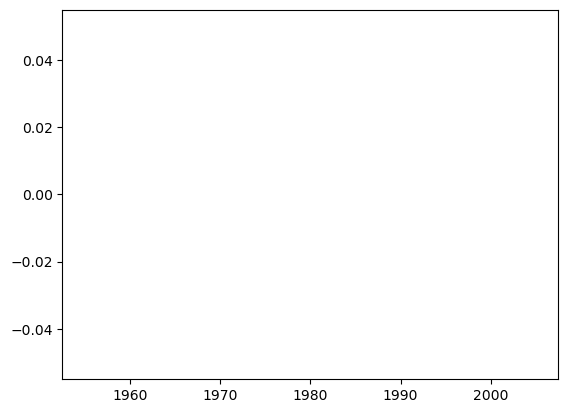
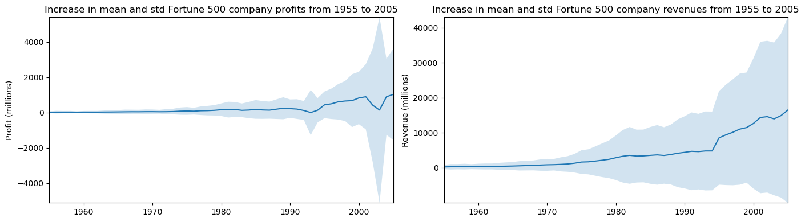
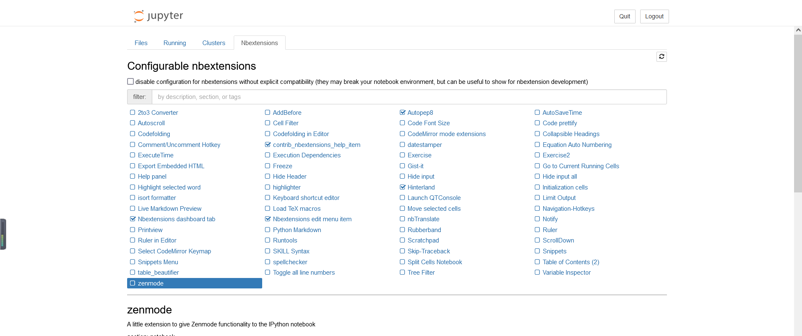

# AndroidProject
A novice developer of Android

## Android研发实践相关软件的安装
### 相关软件以及配置（图片无法显示-在寻找解决办法）

 [Android Studio下载地址](https://developer.android.google.cn/studio):安装4.1以上的版本，更好的支持TensorFlow Lite。
 
   在安装Studio后，还需要下载Android SDK，如果在特殊网络内部的话，可能无法下载，出现Time Out的情况。
 
 
    
 [Python](https://www.python.org/ ):后置其他配置的安装。
 
 [Jupter noteBook]():Jupyter是一个基于Web的交互式计算环境，可以在浏览器中编辑、运行Python、R等语言的代码，并将计算结果可视化。Jupyter最初被称为IPython Notebook，后来发展成为支持多种编程语言和交互式计算的工具。Jupyter的名称来源于三个主要编程语言：Julia、Python和R。它支持代码编写、Markdown格式的文本编辑、数学公式渲染、数据可视化等功能，被广泛用于教学、研究、数据分析、机器学习等领域。
  
 [Anaconda](https://www.anaconda.com/)：Jupyter是一个基于Web的交互式计算环境，可以在浏览器中编辑、运行Python、R等语言的代码，并将计算结果可视化。Jupyter最初被称为IPython Notebook，后来发展成为支持多种编程语言和交互式计算的工具。Jupyter的名称来源于三个主要编程语言：Julia、Python和R。它支持代码编写、Markdown格式的文本编辑、数学公式渲染、数据可视化等功能，被广泛用于教学、研究、数据分析、机器学习等领域。
  

## 构建第一个Kotlin应用

## Jupyter Notebook基础教程

### 1.我首先新建了一个Python3.9的环境，然后打开PowerShell_Prompt
 

在命令行输入(已经安装完Jupyter)：
      
      jupyter notebook

打开后初次创建了ipynb文件，遇到了500问题


通过在网络上搜索相关问题找到了解决办法，原因貌似是因为nbconvert 和pandoc不兼容导致

    pip install --upgrade --user nbconvert

解决问题后再次遇到问题，python内核忙碌中：查询原因大部分都说是因为在用户环境变量里TEMP和TMP存在中文。因为我的电脑刚开始起的用户名为中文（不懂事）。

    //将TEMP之前的都变成%systemroot%
    //将TMP之前的也都变成%systemroot%
    //系要重启电脑，重启服务不能生效



解决问题



### 创建一个新的Notebook


如果没有相应的库的话，可以去anaconda导入：左上角选择All，右上角输入你要导入的包的名字




**cell**

主要包含两种类型的cell：

    代码cell：包含可被kernel执行的代码，执行之后在下方显示输出。
    Markdown cell：书写Markdown标记语言的cell


```python
print('Hello World!')

```

    Hello World!
    
代码执行之后，cell左侧的标签从In [ ] 变成了 In [1]。In代表输入，[]中的数字代表kernel执行的顺序，而In [*]则表示代码cell正在执行代码。以下例子显示了短暂的In [*]过程。

```python
import time

time.sleep(3)
```

快捷键

使用Ctrl + Shift + P命令可以查看所有Notebook支持的命令。

在命名模式下，一些快捷键将十分有帮助

    上下键头可以上下cell移动
    A 或者 B在上方或者下方插入一个cell
    M 将转换活动cell为Markdown cell
    Y 将设置活动cell为代码 cell
    D+D（两次）删除cell
    Z 撤销删除
    H 打开所有快捷键的说明

在编辑模式，Ctrl + Shift + -将以光标处作为分割点，将cell一分为二。

```python
import numpy as np

def square(x):
    return x*x

```


```python

x=np.random.randint(1,10)

y=square(x)

print('%d squared is %d' %(x,y))
```

    4 squared is 16
    
注意：Restart Kernal将清空保存在内存中的变量。同时，在浏览器中关闭一个正在运行的notebook页面，并未真正关闭终止Kernel的运行，其还是后台执行。要真正关闭，可选择File > Close and Halt，或者Kernel > Shutdown。

```python
%matplotlib inline
import pandas as pd
import matplotlib.pyplot as plt
import seaborn as sns
```
pandas用于数据处理，matplotlib用于绘图，seaborn使绘图更美观。第一行不是python命令，而被称为line magic。%表示作用与一行，%%表示作用于全文。此处%matplotlib inline 表示使用matlib画图，并将图片输出。

```python
df = pd.read_csv('fortune500.csv')

df.head()
```


<div>
<style scoped>
    .dataframe tbody tr th:only-of-type {
        vertical-align: middle;
    }

    .dataframe tbody tr th {
        vertical-align: top;
    }

    .dataframe thead th {
        text-align: right;
    }
</style>
<table border="1" class="dataframe">
  <thead>
    <tr style="text-align: right;">
      <th></th>
      <th>Year</th>
      <th>Rank</th>
      <th>Company</th>
      <th>Revenue (in millions)</th>
      <th>Profit (in millions)</th>
    </tr>
  </thead>
  <tbody>
    <tr>
      <th>0</th>
      <td>1955</td>
      <td>1</td>
      <td>General Motors</td>
      <td>9823.5</td>
      <td>806</td>
    </tr>
    <tr>
      <th>1</th>
      <td>1955</td>
      <td>2</td>
      <td>Exxon Mobil</td>
      <td>5661.4</td>
      <td>584.8</td>
    </tr>
    <tr>
      <th>2</th>
      <td>1955</td>
      <td>3</td>
      <td>U.S. Steel</td>
      <td>3250.4</td>
      <td>195.4</td>
    </tr>
    <tr>
      <th>3</th>
      <td>1955</td>
      <td>4</td>
      <td>General Electric</td>
      <td>2959.1</td>
      <td>212.6</td>
    </tr>
    <tr>
      <th>4</th>
      <td>1955</td>
      <td>5</td>
      <td>Esmark</td>
      <td>2510.8</td>
      <td>19.1</td>
    </tr>
  </tbody>
</table>
</div>


```python
df.tail()
```


<div>
<style scoped>
    .dataframe tbody tr th:only-of-type {
        vertical-align: middle;
    }

    .dataframe tbody tr th {
        vertical-align: top;
    }

    .dataframe thead th {
        text-align: right;
    }
</style>
<table border="1" class="dataframe">
  <thead>
    <tr style="text-align: right;">
      <th></th>
      <th>Year</th>
      <th>Rank</th>
      <th>Company</th>
      <th>Revenue (in millions)</th>
      <th>Profit (in millions)</th>
    </tr>
  </thead>
  <tbody>
    <tr>
      <th>25495</th>
      <td>2005</td>
      <td>496</td>
      <td>Wm. Wrigley Jr.</td>
      <td>3648.6</td>
      <td>493</td>
    </tr>
    <tr>
      <th>25496</th>
      <td>2005</td>
      <td>497</td>
      <td>Peabody Energy</td>
      <td>3631.6</td>
      <td>175.4</td>
    </tr>
    <tr>
      <th>25497</th>
      <td>2005</td>
      <td>498</td>
      <td>Wendy's International</td>
      <td>3630.4</td>
      <td>57.8</td>
    </tr>
    <tr>
      <th>25498</th>
      <td>2005</td>
      <td>499</td>
      <td>Kindred Healthcare</td>
      <td>3616.6</td>
      <td>70.6</td>
    </tr>
    <tr>
      <th>25499</th>
      <td>2005</td>
      <td>500</td>
      <td>Cincinnati Financial</td>
      <td>3614.0</td>
      <td>584</td>
    </tr>
  </tbody>
</table>
</div>


```python
df.columns=['year','rank','company','revenue','profit']
```


```python
len(df)
```


    25500


从1955至2055年总共有25500条目录。然后，检查属性列的类型。

```python
df.dtypes
```


    year         int64
    rank         int64
    company     object
    revenue    float64
    profit      object
    dtype: object


```python
non_numberic_profits = df.profit.str.contains('[^0-9.-]')
df.loc[non_numberic_profits].head()
```


<div>
<style scoped>
    .dataframe tbody tr th:only-of-type {
        vertical-align: middle;
    }

    .dataframe tbody tr th {
        vertical-align: top;
    }

    .dataframe thead th {
        text-align: right;
    }
</style>
<table border="1" class="dataframe">
  <thead>
    <tr style="text-align: right;">
      <th></th>
      <th>year</th>
      <th>rank</th>
      <th>company</th>
      <th>revenue</th>
      <th>profit</th>
    </tr>
  </thead>
  <tbody>
    <tr>
      <th>228</th>
      <td>1955</td>
      <td>229</td>
      <td>Norton</td>
      <td>135.0</td>
      <td>N.A.</td>
    </tr>
    <tr>
      <th>290</th>
      <td>1955</td>
      <td>291</td>
      <td>Schlitz Brewing</td>
      <td>100.0</td>
      <td>N.A.</td>
    </tr>
    <tr>
      <th>294</th>
      <td>1955</td>
      <td>295</td>
      <td>Pacific Vegetable Oil</td>
      <td>97.9</td>
      <td>N.A.</td>
    </tr>
    <tr>
      <th>296</th>
      <td>1955</td>
      <td>297</td>
      <td>Liebmann Breweries</td>
      <td>96.0</td>
      <td>N.A.</td>
    </tr>
    <tr>
      <th>352</th>
      <td>1955</td>
      <td>353</td>
      <td>Minneapolis-Moline</td>
      <td>77.4</td>
      <td>N.A.</td>
    </tr>
  </tbody>
</table>
</div>


profit这一列为字符串，统计一下到底存在多少条这样的记录。

```python
len(df.profit[non_numberic_profits])
```


```python
bin_sizes, _, _ = plt.hist(df.year[non_numberic_profits], bins=range(1955, 2006))
```


    

    


```python
df = df.loc[~non_numberic_profits]
df.profit = df.profit.apply(pd.to_numeric)
```


```python
len(df)
```


```python
df.dtypes
```
### 使用matplotlib进行绘图

接下来，以年分组绘制平均利润和收入。首先定义变量和方法。

```python
group_by_year = df.loc[:, ['year', 'revenue', 'profit']].groupby('year')
avgs = group_by_year.mean()
x = avgs.index
y1 = avgs.profit
def plot(x, y, ax, title, y_label):
    ax.set_title(title)
    ax.set_ylabel(y_label)
    ax.plot(x, y)
    ax.margins(x=0, y=0)
```


```python
fig, ax = plt.subplots()
plot(x, y1, ax, 'Increase in mean Fortune 500 company profits from 1955 to 2005', 'Profit (millions)')
```

看起来像指数增长，但是1990年代初期出现急剧的下滑，对应当时经济衰退和网络泡沫。再来看看收入曲线。

```python
y2 = avgs.revenue
fig, ax = plt.subplots()
plot(x, y2, ax, 'Increase in mean Fortune 500 company revenues from 1955 to 2005', 'Revenue (millions)')
```
对数据结果进行标准差处理。

```python
def plot_with_std(x, y, stds, ax, title, y_label):
    ax.fill_between(x, y - stds, y + stds, alpha=0.2)
    plot(x, y, ax, title, y_label)
fig, (ax1, ax2) = plt.subplots(ncols=2)
title = 'Increase in mean and std Fortune 500 company %s from 1955 to 2005'
stds1 = group_by_year.std().profit.values
stds2 = group_by_year.std().revenue.values
plot_with_std(x, y1.values, stds1, ax1, title % 'profits', 'Profit (millions)')
plot_with_std(x, y2.values, stds2, ax2, title % 'revenues', 'Revenue (millions)')
fig.set_size_inches(14, 4)
fig.tight_layout()

```


    

    


### Jupyter Notebook扩展工具

    pip install jupyter_contrib_nbextensions

    jupyter contrib nbextension install --user

    pip install jupyter_nbextensions_configurator

    jupyter nbextensions_configurator enable --user


点击Nbextensions标签，勾选Hinterland：
