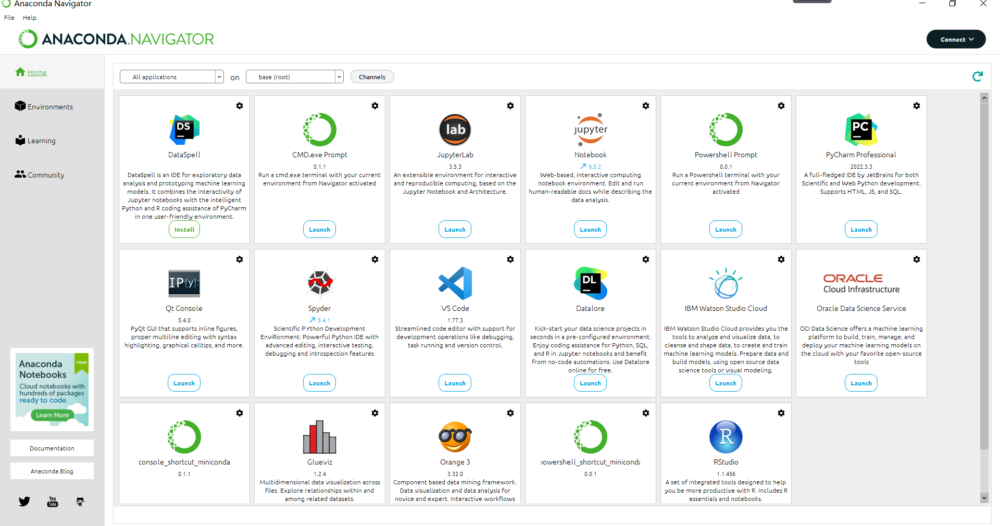

# AndroidProject
A novice developer of Android

## Android研发实践相关软件的安装
### 相关软件以及配置

 [Android Studio下载地址](https://developer.android.google.cn/studio):安装4.1以上的版本，更好的支持TensorFlow Lite。
 
   在安装Studio后，还需要下载Android SDK，如果在特殊网络内部的话，可能无法下载，出现Time Out的情况。
 
 
    
 [Python](https://www.python.org/ ):后置其他配置的安装。
 
 [Jupter noteBook]():Jupyter是一个基于Web的交互式计算环境，可以在浏览器中编辑、运行Python、R等语言的代码，并将计算结果可视化。Jupyter最初被称为IPython Notebook，后来发展成为支持多种编程语言和交互式计算的工具。Jupyter的名称来源于三个主要编程语言：Julia、Python和R。它支持代码编写、Markdown格式的文本编辑、数学公式渲染、数据可视化等功能，被广泛用于教学、研究、数据分析、机器学习等领域。
  
 [Anaconda](https://www.anaconda.com/)：Jupyter是一个基于Web的交互式计算环境，可以在浏览器中编辑、运行Python、R等语言的代码，并将计算结果可视化。Jupyter最初被称为IPython Notebook，后来发展成为支持多种编程语言和交互式计算的工具。Jupyter的名称来源于三个主要编程语言：Julia、Python和R。它支持代码编写、Markdown格式的文本编辑、数学公式渲染、数据可视化等功能，被广泛用于教学、研究、数据分析、机器学习等领域。
  

## 构建第一个Kotlin应用

## Jupyter Notebook基础教程

### 1.我首先新建了一个Python3.9的环境，然后打开PowerShell_Prompt
 

在命令行输入(已经安装完Jupyter)：
      
      jupyter notebook

打开后初次创建了ipynb文件，遇到了500问题


通过在网络上搜索相关问题找到了解决办法，原因貌似是因为nbconvert 和pandoc不兼容导致

    pip install --upgrade --user nbconvert

解决问题后再次遇到问题，python内核忙碌中：查询原因大部分都说是因为在用户环境变量里TEMP和TMP存在中文。因为我的电脑刚开始起的用户名为中文（不懂事）。

    //将TEMP之前的都变成%systemroot%
    //将TMP之前的也都变成%systemroot%
    //系要重启电脑，重启服务不能生效


解决问题


### 创建一个新的Notebook


如果没有相应的库的话，可以去anaconda导入：左上角选择All，右上角输入你要导入的包的名字


**cell**

主要包含两种类型的cell：

    代码cell：包含可被kernel执行的代码，执行之后在下方显示输出。
    Markdown cell：书写Markdown标记语言的cell


```python
print('Hello World!')

```

    Hello World!
    
代码执行之后，cell左侧的标签从In [ ] 变成了 In [1]。In代表输入，[]中的数字代表kernel执行的顺序，而In [*]则表示代码cell正在执行代码。以下例子显示了短暂的In [*]过程。

```python
import time

time.sleep(3)
```

快捷键

使用Ctrl + Shift + P命令可以查看所有Notebook支持的命令。

在命名模式下，一些快捷键将十分有帮助

    上下键头可以上下cell移动
    A 或者 B在上方或者下方插入一个cell
    M 将转换活动cell为Markdown cell
    Y 将设置活动cell为代码 cell
    D+D（两次）删除cell
    Z 撤销删除
    H 打开所有快捷键的说明

在编辑模式，Ctrl + Shift + -将以光标处作为分割点，将cell一分为二。

```python
import numpy as np

def square(x):
    return x*x

```


```python

x=np.random.randint(1,10)

y=square(x)

print('%d squared is %d' %(x,y))
```

    4 squared is 16
    
注意：Restart Kernal将清空保存在内存中的变量。同时，在浏览器中关闭一个正在运行的notebook页面，并未真正关闭终止Kernel的运行，其还是后台执行。要真正关闭，可选择File > Close and Halt，或者Kernel > Shutdown。

```python
%matplotlib inline
import pandas as pd
import matplotlib.pyplot as plt
import seaborn as sns
```
pandas用于数据处理，matplotlib用于绘图，seaborn使绘图更美观。第一行不是python命令，而被称为line magic。%表示作用与一行，%%表示作用于全文。此处%matplotlib inline 表示使用matlib画图，并将图片输出。

```python
df = pd.read_csv('fortune500.csv')

df.head()
```


<div>
<style scoped>
    .dataframe tbody tr th:only-of-type {
        vertical-align: middle;
    }

    .dataframe tbody tr th {
        vertical-align: top;
    }

    .dataframe thead th {
        text-align: right;
    }
</style>
<table border="1" class="dataframe">
  <thead>
    <tr style="text-align: right;">
      <th></th>
      <th>Year</th>
      <th>Rank</th>
      <th>Company</th>
      <th>Revenue (in millions)</th>
      <th>Profit (in millions)</th>
    </tr>
  </thead>
  <tbody>
    <tr>
      <th>0</th>
      <td>1955</td>
      <td>1</td>
      <td>General Motors</td>
      <td>9823.5</td>
      <td>806</td>
    </tr>
    <tr>
      <th>1</th>
      <td>1955</td>
      <td>2</td>
      <td>Exxon Mobil</td>
      <td>5661.4</td>
      <td>584.8</td>
    </tr>
    <tr>
      <th>2</th>
      <td>1955</td>
      <td>3</td>
      <td>U.S. Steel</td>
      <td>3250.4</td>
      <td>195.4</td>
    </tr>
    <tr>
      <th>3</th>
      <td>1955</td>
      <td>4</td>
      <td>General Electric</td>
      <td>2959.1</td>
      <td>212.6</td>
    </tr>
    <tr>
      <th>4</th>
      <td>1955</td>
      <td>5</td>
      <td>Esmark</td>
      <td>2510.8</td>
      <td>19.1</td>
    </tr>
  </tbody>
</table>
</div>


```python
df.tail()
```


<div>
<style scoped>
    .dataframe tbody tr th:only-of-type {
        vertical-align: middle;
    }

    .dataframe tbody tr th {
        vertical-align: top;
    }

    .dataframe thead th {
        text-align: right;
    }
</style>
<table border="1" class="dataframe">
  <thead>
    <tr style="text-align: right;">
      <th></th>
      <th>Year</th>
      <th>Rank</th>
      <th>Company</th>
      <th>Revenue (in millions)</th>
      <th>Profit (in millions)</th>
    </tr>
  </thead>
  <tbody>
    <tr>
      <th>25495</th>
      <td>2005</td>
      <td>496</td>
      <td>Wm. Wrigley Jr.</td>
      <td>3648.6</td>
      <td>493</td>
    </tr>
    <tr>
      <th>25496</th>
      <td>2005</td>
      <td>497</td>
      <td>Peabody Energy</td>
      <td>3631.6</td>
      <td>175.4</td>
    </tr>
    <tr>
      <th>25497</th>
      <td>2005</td>
      <td>498</td>
      <td>Wendy's International</td>
      <td>3630.4</td>
      <td>57.8</td>
    </tr>
    <tr>
      <th>25498</th>
      <td>2005</td>
      <td>499</td>
      <td>Kindred Healthcare</td>
      <td>3616.6</td>
      <td>70.6</td>
    </tr>
    <tr>
      <th>25499</th>
      <td>2005</td>
      <td>500</td>
      <td>Cincinnati Financial</td>
      <td>3614.0</td>
      <td>584</td>
    </tr>
  </tbody>
</table>
</div>


```python
df.columns=['year','rank','company','revenue','profit']
```


```python
len(df)
```


    25500


从1955至2055年总共有25500条目录。然后，检查属性列的类型。

```python
df.dtypes
```


    year         int64
    rank         int64
    company     object
    revenue    float64
    profit      object
    dtype: object


```python
non_numberic_profits = df.profit.str.contains('[^0-9.-]')
df.loc[non_numberic_profits].head()
```


<div>
<style scoped>
    .dataframe tbody tr th:only-of-type {
        vertical-align: middle;
    }

    .dataframe tbody tr th {
        vertical-align: top;
    }

    .dataframe thead th {
        text-align: right;
    }
</style>
<table border="1" class="dataframe">
  <thead>
    <tr style="text-align: right;">
      <th></th>
      <th>year</th>
      <th>rank</th>
      <th>company</th>
      <th>revenue</th>
      <th>profit</th>
    </tr>
  </thead>
  <tbody>
    <tr>
      <th>228</th>
      <td>1955</td>
      <td>229</td>
      <td>Norton</td>
      <td>135.0</td>
      <td>N.A.</td>
    </tr>
    <tr>
      <th>290</th>
      <td>1955</td>
      <td>291</td>
      <td>Schlitz Brewing</td>
      <td>100.0</td>
      <td>N.A.</td>
    </tr>
    <tr>
      <th>294</th>
      <td>1955</td>
      <td>295</td>
      <td>Pacific Vegetable Oil</td>
      <td>97.9</td>
      <td>N.A.</td>
    </tr>
    <tr>
      <th>296</th>
      <td>1955</td>
      <td>297</td>
      <td>Liebmann Breweries</td>
      <td>96.0</td>
      <td>N.A.</td>
    </tr>
    <tr>
      <th>352</th>
      <td>1955</td>
      <td>353</td>
      <td>Minneapolis-Moline</td>
      <td>77.4</td>
      <td>N.A.</td>
    </tr>
  </tbody>
</table>
</div>


profit这一列为字符串，统计一下到底存在多少条这样的记录。

```python
len(df.profit[non_numberic_profits])
```


```python
bin_sizes, _, _ = plt.hist(df.year[non_numberic_profits], bins=range(1955, 2006))
```


    

    


```python
df = df.loc[~non_numberic_profits]
df.profit = df.profit.apply(pd.to_numeric)
```


```python
len(df)
```


```python
df.dtypes
```
### 使用matplotlib进行绘图

接下来，以年分组绘制平均利润和收入。首先定义变量和方法。

```python
group_by_year = df.loc[:, ['year', 'revenue', 'profit']].groupby('year')
avgs = group_by_year.mean()
x = avgs.index
y1 = avgs.profit
def plot(x, y, ax, title, y_label):
    ax.set_title(title)
    ax.set_ylabel(y_label)
    ax.plot(x, y)
    ax.margins(x=0, y=0)
```


```python
fig, ax = plt.subplots()
plot(x, y1, ax, 'Increase in mean Fortune 500 company profits from 1955 to 2005', 'Profit (millions)')
```

看起来像指数增长，但是1990年代初期出现急剧的下滑，对应当时经济衰退和网络泡沫。再来看看收入曲线。

```python
y2 = avgs.revenue
fig, ax = plt.subplots()
plot(x, y2, ax, 'Increase in mean Fortune 500 company revenues from 1955 to 2005', 'Revenue (millions)')
```
对数据结果进行标准差处理。

```python
def plot_with_std(x, y, stds, ax, title, y_label):
    ax.fill_between(x, y - stds, y + stds, alpha=0.2)
    plot(x, y, ax, title, y_label)
fig, (ax1, ax2) = plt.subplots(ncols=2)
title = 'Increase in mean and std Fortune 500 company %s from 1955 to 2005'
stds1 = group_by_year.std().profit.values
stds2 = group_by_year.std().revenue.values
plot_with_std(x, y1.values, stds1, ax1, title % 'profits', 'Profit (millions)')
plot_with_std(x, y2.values, stds2, ax2, title % 'revenues', 'Revenue (millions)')
fig.set_size_inches(14, 4)
fig.tight_layout()

```


    

    


### Jupyter Notebook扩展工具

    pip install jupyter_contrib_nbextensions

    jupyter contrib nbextension install --user

    pip install jupyter_nbextensions_configurator

    jupyter nbextensions_configurator enable --user


点击Nbextensions标签，勾选Hinterland：


## 基于TensorFlow Lite实现Android花朵识别应用

### 下载项目工作目录

    git clone https://github.com/hoitab/TFLClassify.git


初次使用遇到的问题
      
      1.你的主机中的软件中止了一个可建立的连接
      解决:关闭电脑WIFI的移动热点

      2.SDk的问题，可能和目录中设置的依赖不同，可以选择更改或者到Setting中下载缺失的SDK。


Build后选择连接的真机


遇到的问题

    连接不上真机

    需要在AS上安装对应真机的SDK platforms，以及安装SDK Tools里的Google usb drivers

    具体教程：
    
  [连接真机办法](https://blog.csdn.net/qq_53317005/article/details/127679537)

  另外可能还会遇到连接不上的情况，比如我的手机是鸿蒙系统的，虽然下载了相关的配置，但是依旧不行，可以试试先连接他自己的手机管理工具。

  

  然后去AS里的Troubleshoot Device Connection,按照步骤就能连接了。


### 检查代码里的TODO项

View>Tool Windows>TODO


### 添加代码重新运行APP


1.定位“start”模块MainActivity.kt文件的TODO 1，添加初始化训练模型的代码

    private class ImageAnalyzer(ctx: Context, private val listener: RecognitionListener) :
        ImageAnalysis.Analyzer {

      ...
      // TODO 1: Add class variable TensorFlow Lite Model
      private val flowerModel = FlowerModel.newInstance(ctx)

      ...
    }

2.在CameraX的analyze方法内部，需要将摄像头的输入ImageProxy转化为Bitmap对象，并进一步转化为TensorImage 对象

    override fun analyze(imageProxy: ImageProxy) {
      ...
      // TODO 2: Convert Image to Bitmap then to TensorImage
      val tfImage = TensorImage.fromBitmap(toBitmap(imageProxy))
      ...
    }

3.在CameraX的analyze方法内部，需要将摄像头的输入ImageProxy转化为Bitmap对象，并进一步转化为TensorImage 对象

  · 按照属性score对识别结果按照概率从高到低排序

  · 列出最高k种可能的结果，k的结果由常量MAX_RESULT_DISPLAY定义

    override fun analyze(imageProxy: ImageProxy) {
      ...
      // TODO 2: Convert Image to Bitmap then to TensorImage
      val tfImage = TensorImage.fromBitmap(toBitmap(imageProxy))
      ...
    }


4.将识别的结果加入数据对象Recognition 中，包含label和score两个元素。后续将用于RecyclerView的数据显示

    override fun analyze(imageProxy: ImageProxy) {
    ...
      // TODO 4: Converting the top probability items into a list of recognitions
      for (output in outputs) {
          items.add(Recognition(output.label, output.score))
      }
      ...
    }

5.将原先用于虚拟显示识别结果的代码注释掉或者删除

    // START - Placeholder code at the start of the codelab. Comment this block of code out.
    for (i in 0..MAX_RESULT_DISPLAY-1){
        items.add(Recognition("Fake label $i", Random.nextFloat()))
    }
    // END - Placeholder code at the start of the codelab. Comment this block of code out.


6.以物理设备重新运行start模块

7.最终运行效果


## Tensorflow训练剪刀石头布数据模型

### 下载相关数据，路径根据自己情况修改

    !wget --no-check-certificate https://storage.googleapis.com/learning-datasets/rps.zip -O D:/Game/rps.zip
  

    !wget --no-check-certificate https://storage.googleapis.com/learning-datasets/rps-test-set.zip -O D:/Game/rps-test-set.zip

### 或者直接下载

  训练集:https://storage.googleapis.com/learning-datasets/rps.zip

  测试集:https://storage.googleapis.com/learning-datasets/rps-test-set.zip

### 在Notebook中，解压下载好的包
```python
import os
import zipfile

local_zip = 'D:/EDdown/rps.zip'
zip_ref = zipfile.ZipFile(local_zip, 'r')
zip_ref.extractall('D:/jupyter_datafolder/')
zip_ref.close()

local_zip = 'D:/EDdown/rps-test-set.zip'
zip_ref = zipfile.ZipFile(local_zip, 'r')
zip_ref.extractall('D:/jupyter_datafolder/')
zip_ref.close()
```

### 检测解压结果，打印解压信息

```python
rock_dir = os.path.join('D:/jupyter_datafolder/rps/rock')
paper_dir = os.path.join('D:/jupyter_datafolder/rps/paper')
scissors_dir = os.path.join('D:/jupyter_datafolder/rps/scissors')

print('total training rock images:', len(os.listdir(rock_dir)))
print('total training paper images:', len(os.listdir(paper_dir)))
print('total training scissors images:', len(os.listdir(scissors_dir)))

rock_files = os.listdir(rock_dir)
print(rock_files[:10])

paper_files = os.listdir(paper_dir)
print(paper_files[:10])

scissors_files = os.listdir(scissors_dir)
print(scissors_files[:10])
```

### 各打印两张剪刀石头布的图形

    total training rock images: 840
    total training paper images: 840
    total training scissors images: 840
    ['rock01-000.png', 'rock01-001.png', 'rock01-002.png', 'rock01-003.png', 'rock01-004.png', 'rock01-005.png', 'rock01-006.png', 'rock01-007.png', 'rock01-008.png', 'rock01-009.png']
    ['paper01-000.png', 'paper01-001.png', 'paper01-002.png', 'paper01-003.png', 'paper01-004.png', 'paper01-005.png', 'paper01-006.png', 'paper01-007.png', 'paper01-008.png', 'paper01-009.png']
    ['scissors01-000.png', 'scissors01-001.png', 'scissors01-002.png', 'scissors01-003.png', 'scissors01-004.png', 'scissors01-005.png', 'scissors01-006.png', 'scissors01-007.png', 'scissors01-008.png', 'scissors01-009.png']
    


```python
%matplotlib inline

import matplotlib.pyplot as plt
import matplotlib.image as mpimg

pic_index = 2

next_rock = [os.path.join(rock_dir, fname) 
                for fname in rock_files[pic_index-2:pic_index]]
next_paper = [os.path.join(paper_dir, fname) 
                for fname in paper_files[pic_index-2:pic_index]]
next_scissors = [os.path.join(scissors_dir, fname) 
                for fname in scissors_files[pic_index-2:pic_index]]

for i, img_path in enumerate(next_rock+next_paper+next_scissors):
  #print(img_path)
  img = mpimg.imread(img_path)
  plt.imshow(img)
  plt.axis('Off')
  plt.show()

```


    

    


    

    


    

    


    

    


    

    


    

    

### 调用TensorFlow的keras进行数据模型的训练和评估。Keras是开源人工神经网络库，TensorFlow集成了keras的调用接口，可以方便的使用。


```python
import tensorflow as tf
import keras_preprocessing
from keras_preprocessing import image
from keras_preprocessing.image import ImageDataGenerator

TRAINING_DIR = "D:/jupyter_datafolder/rps/"
training_datagen = ImageDataGenerator(
      rescale = 1./255,
	    rotation_range=40,
      width_shift_range=0.2,
      height_shift_range=0.2,
      shear_range=0.2,
      zoom_range=0.2,
      horizontal_flip=True,
      fill_mode='nearest')

VALIDATION_DIR = "D:/jupyter_datafolder/rps-test-set/"
validation_datagen = ImageDataGenerator(rescale = 1./255)

train_generator = training_datagen.flow_from_directory(
	TRAINING_DIR,
	target_size=(150,150),
	class_mode='categorical',
  batch_size=126
)

validation_generator = validation_datagen.flow_from_directory(
	VALIDATION_DIR,
	target_size=(150,150),
	class_mode='categorical',
  batch_size=126
)

model = tf.keras.models.Sequential([
    # Note the input shape is the desired size of the image 150x150 with 3 bytes color
    # This is the first convolution
    tf.keras.layers.Conv2D(64, (3,3), activation='relu', input_shape=(150, 150, 3)),
    tf.keras.layers.MaxPooling2D(2, 2),
    # The second convolution
    tf.keras.layers.Conv2D(64, (3,3), activation='relu'),
    tf.keras.layers.MaxPooling2D(2,2),
    # The third convolution
    tf.keras.layers.Conv2D(128, (3,3), activation='relu'),
    tf.keras.layers.MaxPooling2D(2,2),
    # The fourth convolution
    tf.keras.layers.Conv2D(128, (3,3), activation='relu'),
    tf.keras.layers.MaxPooling2D(2,2),
    # Flatten the results to feed into a DNN
    tf.keras.layers.Flatten(),
    tf.keras.layers.Dropout(0.5),
    # 512 neuron hidden layer
    tf.keras.layers.Dense(512, activation='relu'),
    tf.keras.layers.Dense(3, activation='softmax')
])


model.summary()

model.compile(loss = 'categorical_crossentropy', optimizer='rmsprop', metrics=['accuracy'])

history = model.fit(train_generator, epochs=25, steps_per_epoch=20, validation_data = validation_generator, verbose = 1, validation_steps=3)

model.save("rps.h5")

```

    Found 2520 images belonging to 3 classes.
    Found 372 images belonging to 3 classes.
    Model: "sequential"
    _________________________________________________________________
     Layer (type)                Output Shape              Param #   
    =================================================================
     conv2d (Conv2D)             (None, 148, 148, 64)      1792      
                                                                     
     max_pooling2d (MaxPooling2D  (None, 74, 74, 64)       0         
     )                                                               
                                                                     
     conv2d_1 (Conv2D)           (None, 72, 72, 64)        36928     
                                                                     
     max_pooling2d_1 (MaxPooling  (None, 36, 36, 64)       0         
     2D)                                                             
                                                                     
     conv2d_2 (Conv2D)           (None, 34, 34, 128)       73856     
                                                                     
     max_pooling2d_2 (MaxPooling  (None, 17, 17, 128)      0         
     2D)                                                             
                                                                     
     conv2d_3 (Conv2D)           (None, 15, 15, 128)       147584    
                                                                     
     max_pooling2d_3 (MaxPooling  (None, 7, 7, 128)        0         
     2D)                                                             
                                                                     
     flatten (Flatten)           (None, 6272)              0         
                                                                     
     dropout (Dropout)           (None, 6272)              0         
                                                                     
     dense (Dense)               (None, 512)               3211776   
                                                                     
     dense_1 (Dense)             (None, 3)                 1539      
                                                                     
    =================================================================
    Total params: 3,473,475
    Trainable params: 3,473,475
    Non-trainable params: 0
    _________________________________________________________________
    Epoch 1/25
    20/20 [==============================] - 40s 2s/step - loss: 1.7047 - accuracy: 0.3433 - val_loss: 1.0858 - val_accuracy: 0.4812
    Epoch 2/25
    20/20 [==============================] - 39s 2s/step - loss: 1.1009 - accuracy: 0.3690 - val_loss: 1.3624 - val_accuracy: 0.3333
    Epoch 3/25
    20/20 [==============================] - 39s 2s/step - loss: 1.0970 - accuracy: 0.3980 - val_loss: 0.8634 - val_accuracy: 0.6935
    Epoch 4/25
    20/20 [==============================] - 39s 2s/step - loss: 1.0457 - accuracy: 0.4579 - val_loss: 0.8609 - val_accuracy: 0.5349
    Epoch 5/25
    20/20 [==============================] - 39s 2s/step - loss: 0.9070 - accuracy: 0.5718 - val_loss: 0.5119 - val_accuracy: 0.9086
    Epoch 6/25
    20/20 [==============================] - 40s 2s/step - loss: 0.8909 - accuracy: 0.6242 - val_loss: 0.4716 - val_accuracy: 0.9785
    Epoch 7/25
    20/20 [==============================] - 39s 2s/step - loss: 0.6111 - accuracy: 0.7373 - val_loss: 0.5425 - val_accuracy: 0.7527
    Epoch 8/25
    20/20 [==============================] - 39s 2s/step - loss: 0.5414 - accuracy: 0.7718 - val_loss: 1.3219 - val_accuracy: 0.5134
    Epoch 9/25
    20/20 [==============================] - 39s 2s/step - loss: 0.4557 - accuracy: 0.8167 - val_loss: 0.1103 - val_accuracy: 1.0000
    Epoch 10/25
    20/20 [==============================] - 39s 2s/step - loss: 0.4686 - accuracy: 0.8345 - val_loss: 0.3001 - val_accuracy: 0.8548
    Epoch 11/25
    20/20 [==============================] - 39s 2s/step - loss: 0.4024 - accuracy: 0.8663 - val_loss: 0.1617 - val_accuracy: 0.9866
    Epoch 12/25
    20/20 [==============================] - 39s 2s/step - loss: 0.2340 - accuracy: 0.9095 - val_loss: 0.0238 - val_accuracy: 1.0000
    Epoch 13/25
    20/20 [==============================] - 38s 2s/step - loss: 0.2396 - accuracy: 0.9107 - val_loss: 0.1012 - val_accuracy: 0.9839
    Epoch 14/25
    20/20 [==============================] - 39s 2s/step - loss: 0.2730 - accuracy: 0.9032 - val_loss: 0.0611 - val_accuracy: 1.0000
    Epoch 15/25
    20/20 [==============================] - 40s 2s/step - loss: 0.1950 - accuracy: 0.9262 - val_loss: 0.0349 - val_accuracy: 1.0000
    Epoch 16/25
    20/20 [==============================] - 39s 2s/step - loss: 0.1342 - accuracy: 0.9528 - val_loss: 0.1297 - val_accuracy: 0.9140
    Epoch 17/25
    20/20 [==============================] - 40s 2s/step - loss: 0.2166 - accuracy: 0.9202 - val_loss: 0.0171 - val_accuracy: 1.0000
    Epoch 18/25
    20/20 [==============================] - 40s 2s/step - loss: 0.1837 - accuracy: 0.9341 - val_loss: 0.0828 - val_accuracy: 0.9919
    Epoch 19/25
    20/20 [==============================] - 39s 2s/step - loss: 0.1224 - accuracy: 0.9603 - val_loss: 0.0094 - val_accuracy: 1.0000
    Epoch 20/25
    20/20 [==============================] - 39s 2s/step - loss: 0.0949 - accuracy: 0.9675 - val_loss: 0.0109 - val_accuracy: 1.0000
    Epoch 21/25
    20/20 [==============================] - 39s 2s/step - loss: 0.1323 - accuracy: 0.9508 - val_loss: 0.0152 - val_accuracy: 0.9973
    Epoch 22/25
    20/20 [==============================] - 39s 2s/step - loss: 0.0810 - accuracy: 0.9762 - val_loss: 0.0119 - val_accuracy: 1.0000
    Epoch 23/25
    20/20 [==============================] - 39s 2s/step - loss: 0.1269 - accuracy: 0.9516 - val_loss: 0.0298 - val_accuracy: 0.9866
    Epoch 24/25
    20/20 [==============================] - 39s 2s/step - loss: 0.0747 - accuracy: 0.9746 - val_loss: 0.0172 - val_accuracy: 1.0000
    Epoch 25/25
    20/20 [==============================] - 39s 2s/step - loss: 0.2240 - accuracy: 0.9290 - val_loss: 0.0277 - val_accuracy: 0.9919
    

### 绘制训练和结果的相关信息

```python
import matplotlib.pyplot as plt
acc = history.history['accuracy']
val_acc = history.history['val_accuracy']
loss = history.history['loss']
val_loss = history.history['val_loss']

epochs = range(len(acc))

plt.plot(epochs, acc, 'r', label='Training accuracy')
plt.plot(epochs, val_acc, 'b', label='Validation accuracy')
plt.title('Training and validation accuracy')
plt.legend(loc=0)
plt.figure()
plt.show()

```


    

    


    <Figure size 640x480 with 0 Axes>

