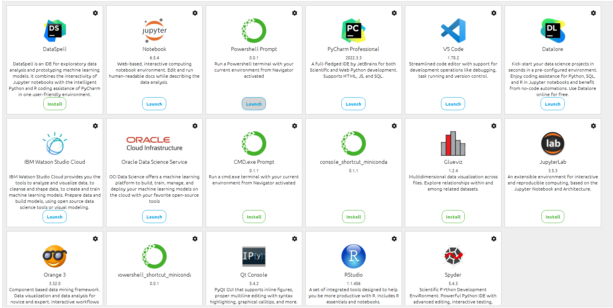

# AndroidProject
A novice developer of Android

## Android研发实践相关软件的安装
### 相关软件以及配置（图片无法显示-在寻找解决办法）

 [Android Studio下载地址](https://developer.android.google.cn/studio):安装4.1以上的版本，更好的支持TensorFlow Lite。
 
   在安装Studio后，还需要下载Android SDK，如果在特殊网络内部的话，可能无法下载，出现Time Out的情况。
 
 
    
 [Python](https://www.python.org/ ):后置其他配置的安装。
 
 [Jupter noteBook]():Jupyter是一个基于Web的交互式计算环境，可以在浏览器中编辑、运行Python、R等语言的代码，并将计算结果可视化。Jupyter最初被称为IPython Notebook，后来发展成为支持多种编程语言和交互式计算的工具。Jupyter的名称来源于三个主要编程语言：Julia、Python和R。它支持代码编写、Markdown格式的文本编辑、数学公式渲染、数据可视化等功能，被广泛用于教学、研究、数据分析、机器学习等领域。
  
 [Anaconda](https://www.anaconda.com/)：Jupyter是一个基于Web的交互式计算环境，可以在浏览器中编辑、运行Python、R等语言的代码，并将计算结果可视化。Jupyter最初被称为IPython Notebook，后来发展成为支持多种编程语言和交互式计算的工具。Jupyter的名称来源于三个主要编程语言：Julia、Python和R。它支持代码编写、Markdown格式的文本编辑、数学公式渲染、数据可视化等功能，被广泛用于教学、研究、数据分析、机器学习等领域。
  

## 构建第一个Kotlin应用

## Jupyter Notebook基础教程

### 1.我首先新建了一个Python3.9的环境，然后打开PowerShell_Prompt
 

在命令行输入(已经安装完Jupyter)：
      
      jupyter notebook

打开后初次创建了ipynb文件，遇到了500问题

通过在网络上搜索相关问题找到了解决办法，原因貌似是因为nbconvert 和pandoc不兼容导致

    pip install --upgrade --user nbconvert

解决问题后再次遇到问题，python内核忙碌中：查询原因大部分都说是因为在用户环境变量里TEMP和TMP存在中文。因为我的电脑刚开始起的用户名为中文（不懂事）。

    //将TEMP之前的都变成%systemroot%
    //将TMP之前的也都变成%systemroot%
    //系要重启电脑，重启服务不能生效

解决问题

